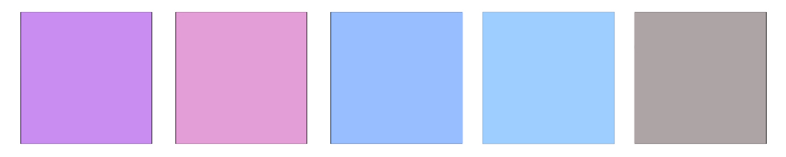

<a name="readme-top"></a>

<!-- Top Links Bar -->

[![LinkedIn][linkedin-shield]][linkedin-url]
[![Twitter][twitter-shield]][twitter-url]
[![Instagram][instagram-shield]][instagram-url]

<!-- PROJECT LOGO -->
<br />
<div align="center">
  
  <h1 align="center">Basic (Really basic) Workout tracker</h1>

<!-- PROJECT desc -->
  <p align="left">
      Because my gym's app sucks.
      The code is based on   <a href="https://github.com/HypeTeqSoftware/FitnessApp"><strong>FitnessApp »</strong></a> 
  </p>

  <!-- PROJECT link -->
  <p align="left">
    <a href="https://github.com/foxnoir/chibi"><strong>Explore the project »</strong></a>
    <br/>
  </p>
  </p>
    <br/>
  </p>****

  <p align="left">
  Chibi supports only (iOS) mobile, clone the appropriate branches mentioned below:
  </p>

<!-- Get started link link -->
  <p align="left">
    <a href="#getting-started"><strong>Getting Started »</strong></a>
    <br/>
  </p>
    <br/>
  </p>

</div>

<!-- TABLE OF CONTENTS -->
<details>
  <summary>Table of Contents</summary>
  <ol>
      <li>
      <a href="#style-guide">Style Guide</a>
      <ul>
        <li><a href="#color-palette">Color Palette</a></li>
      </ul>
      <ul>
        <li><a href="#fonts">Fonts</a></li>
      </ul>
      <ul>
        <li><a href="#icons">Icons</a></li>
      </ul>
      <ul>
        <li><a href="#final-layout">Final Layout</a></li>
      </ul>
    </li>
    <li>
      <a href="#App-Demonstration">App Demonstration</a>
    </li>
    <li>
      <a href="#tech-stack">Tech Stack</a>
      <ul>
        <li><a href="#build-with">Build With</a></li>
      </ul>
      <ul>
        <li><a href="#Libraries-And-Tools"> Libraries And Tools</a></li>
      </ul>
    </li>
    <li>
      <a href="#getting-started">Getting Started</a>
    </li>
    <li>
      <a href="#hide-generated-files">Hide Generated Files</a>
    </li>
    <li>
      <a href="#project-structure">Project Structure</a>
      <ul>
        <li><a href="#folder-structure">Folder Structure</a></li>
      </ul>
      <ul>
        <li><a href="#general-feature-structure">General feature structure</a></li>
      </ul>
    </li>
    <li><a href="#images">Images</a></li>
    <li><a href="#changelog">Changelog</a></li>
    <li><a href="#license">License</a></li>
    <li><a href="#acknowledgments">Acknowledgments</a></li>
  </ol>
</details>

</p>
  <br/>
</p>

## Style Guide

### Color Palette



### Fonts

- [Default Flutter ios font (San Francisco)](https://developer.apple.com/fonts/)

### Icons

- [Default Flutter materials icons](https://api.flutter.dev/flutter/material/Icons-class.html)

### Final Layout

<!-- 

  <p align="left">
    <a href="#References-to-the-images-used"><strong>References to the images used »</strong></a>
    <br/>
  </p> -->

<p align="right">(<a href="#readme-top">back to top</a>)</p>

## App Demonstration

<!-- > :warning: **(german only)**

https://user-images.githubusercontent.com/95978076/200083313-cf531a3b-6c2c-4495-9085-6212818a285b.mp4 -->

<p align="right">(<a href="#readme-top">back to top</a>)</p>

## Tech Stack

### Build With

- [![Flutter][flutter]][flutter-url]
- [![Dart][dart]][dart-url]
- [![Firebase][firebase]][firebase-url]

### Libraries And Tools

<!-- - [UserModelentification](https://firebase.google.com/docs/auth)
- [Cloud FirebaseFirestore](https://firebase.google.com/docs/FirebaseFirestore)
- [Cloud Storage Firebase](https://firebase.google.com/docs/storage)
- [Routing](https://api.flutter.dev/flutter/widgets/RouteObserver-class.html)
- [Theme](https://docs.flutter.dev/cookbook/design/themes) (basic)
- [Provider](https://github.com/rrousselGit/provider) (state management)
- [Validation](https://github.com/dart-league/validators)
- [Dark Theme Support](https://medium.flutterdevs.com/implement-dark-mode-in-flutter-using-provider-158925112bf9) (basic) -->

<p align="right">(<a href="#readme-top">back to top</a>)</p>

## Getting Started

- Download or clone this repo by using the link or the SSH URL below:

```
https://github.com/foxnoir/chibi
```

```
git@github.com:foxnoir/chibi.git
```

- Go to project root and execute the following command in console to get the required dependencies:

```
flutter pub get
```

 <br/>
```
flutter packages pub run build_runner build --delete-conflicting-outputs
```

- Create a new Firebase project and connect the app with it. For clearer instructions go to: [Connect flutter with firebase »](https://firebase.google.com/docs/flutter/setup?platform=ios)

- Enable Firebase authentication with email and password. For clearer instructions go to: [Firebase authentication »](https://firebase.google.com/docs/auth)

- Create a Firestore Database. For clearer instructions go to: [Create a Firebase firestore database »](https://www.kodeco.com/26435435-firestore-tutorial-for-flutter-getting-started)

- Create a Cloud Storage. For clearer instructions go to: [Create a Firebase cloud storage »](https://www.kodeco.com/26435435-firestore-tutorial-for-flutter-getting-started)

- Open - [XCode Simulator](https://developer.apple.com/documentation/xcode/running-your-app-in-simulator-or-on-a-device) and start 2 devices or start 1 on your iPhone via Xcode and 1 in the simulator. For clearer instructions go to: [Running your app in Simulator or on a device »](https://developer.apple.com/documentation/xcode/running-your-app-in-simulator-or-on-a-device)

- Register a new user on each device. (User A on device A, User B on device B).

- Add user B as a new contact on device A using the email address you registered user B with and favorite this one under `All Contacts`.

- Go to `Favorites` and click on the user's profile picture.

- Start chatting.

<p align="right">(<a href="#readme-top">back to top</a>)</p>

## Hide Generated Files

In-order to hide generated files, navigate to `Android Studio` -> `Preferences` -> `Editor` -> `File Types` and paste the below lines under `ignore files and folders` section:

```
*.inject.summary;*.inject.dart;*.g.dart;
```

In Visual Studio Code, navigate to `Preferences` -> `Settings` and search for `Files:Exclude`. Add the following patterns:

```
###/*.inject.summary
###/*.inject.dart
###/*.g.dart
```

<p align="right">(<a href="#readme-top">back to top</a>)</p>

## Project Structure

The project was structured according to the feature-first approach. A feature here is more what the user does and not what he sees.

<p align="left">
  <a href="https://codewithandrea.com/articles/flutter-project-structure/"><strong>Learn more about feature-first »</strong></a>
  <br/>
</p>

### Folder Structure

The core folder structure which flutter provides:

```
flutter-app/
|- android
|- assets
|- build
|- images
|- ios
|- lib
|- test
|- web
```

Project folder structure:

```
lib/
|- Consts/
|- features/
|- global_widgets/
|- routing/
|- utils/
|- main.dart
```

### General feature structure

_NOTE 1:_ Not every feature always has all 3 layers.
<br/>
_NOTE 2:_ Not every presentation layer always has a widgets folder. This folder contains only widgets that are used exclusively by the respective feature.

```
feature/
|- data
|- domain
|- presentation/
  |- widgets
```

- data: data sources, repositories, and data transfer objects– DTOs

- domain: models

- presentation: states, widgets, and controllers

<p align="right">(<a href="#readme-top">back to top</a>)</p>

## Images 
- [Chibiusa with gun](https://www.redbubble.com/de/i/sticker/Waffe-Chibi-USA-von-reinbowsketch/144161640.EJUG5) -> © [reinbowsketch](https://www.redbubble.com/de/people/reinbowsketch/shop) 
- [Chibiusa Profile](https://fuckyeahsailorchibimoon.tumblr.com/post/122936579729)  
- [Statistics nav icon](https://www.freepik.com/icon/statistics_3350134)  
- [Dumbbell nav icon](https://en.silhouette-ac.com/silhouette/142364/dumbbell)  
- [Video nav icon](https://www.pngegg.com/en/png-njobs)  


<p align="right">(<a href="#readme-top">back to top</a>)</p>

## Changelog

  <p align="left">
    <a href="https://github.com/foxnoir/messenger/blob/main/CHANGELOG.md"><strong>Check changes »</strong></a>
    <br/>
  </p>
  </p>
    <br/>
  </p>

<p align="right">(<a href="#readme-top">back to top</a>)</p>

## License

Distributed under the [MIT License](https://github.com/foxnoir/messenger/blob/main/LICENSE.txt).

<p align="right">(<a href="#readme-top">back to top</a>)</p>

## Acknowledgments

- [Feature-first vs Layer-first 1](https://kodytechnolab.com/blog/layer-first-or-feature-first-flutter-project-structure/)
- [Feature-first vs Layer-first 2](https://codewithandrea.com/articles/flutter-project-structure/)
- [Connect flutter with firebase](https://firebase.google.com/docs/flutter/setup?platform=ios)
- [Running your app in Simulator or on a device](https://developer.apple.com/documentation/xcode/running-your-app-in-simulator-or-on-a-device)

<p align="right">(<a href="#readme-top">back to top</a>)</p>

<!-- Top Bar Links -->

[license-shield]: https://img.shields.io/github/license/othneildrew/Best-README-Template.svg?style=for-the-badge
[license-url]: https://github.com/othneildrew/Best-README-Template/blob/master/LICENSE.txt
[linkedin-shield]: https://img.shields.io/badge/-LinkedIn-black.svg?style=for-the-badge&logo=linkedin&colorB=555
[linkedin-url]: https://www.linkedin.com/in/tanja-polz-5636401a5/
[twitter-shield]: https://img.shields.io/badge/Twitter-%231DA1F2.svg?style=for-the-badge&logo=Twitter&logoColor=white
[twitter-url]: https://twitter.com/_foxnoir_?lang=de
[instagram-shield]: https://img.shields.io/badge/Instagram-%23E4405F.svg?style=for-the-badge&logo=Instagram&logoColor=white
[instagram-url]: https://www.instagram.com/_foxnoir_/

<!-- Tech Stach Links-->

[flutter]: https://img.shields.io/badge/Flutter-%2302569B.svg?style=for-the-badge&logo=Flutter&logoColor=white
[flutter-url]: https://flutter.dev/
[dart]: https://img.shields.io/badge/dart-%230175C2.svg?style=for-the-badge&logo=dart&logoColor=white
[dart-url]: https://dart.dev/
[flutter-url]: https://flutter.dev/
[firebase]: https://img.shields.io/badge/Firebase-039BE5?style=for-the-badge&logo=Firebase&logoColor=white
[firebase-url]: https://firebase.google.com/
